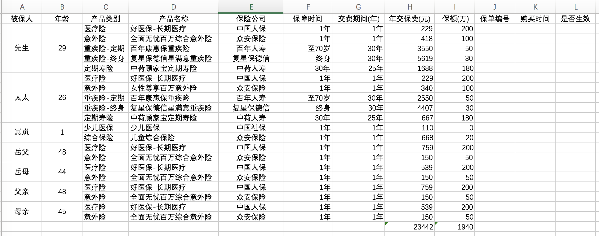

# 给家庭撑好一把保护伞

## 1. 前言
	
### 1.1 黑天鹅事件是什么？

黑天鹅事件是指极其罕见的、难以预测、产生重大影响的事件。

常见的黑天鹅事件
* 泰坦尼克号
* 金融风暴
* “9·11”事件
* 中国雪灾
* 封刀事件挫伤爱尔眼科
* 特朗普赢得美国大选

### 1.2 人生黑天鹅事件
* 轻症疾病
* 重大疾病
* 意外身残
* 意外全残
* 意外身故
* 疾病身故

### 1.3 事件导致风险
1. 因病返贫，瞬间掏空一个家庭十几年的积蓄
2. 因故丧能，上孝父母，下养子女，贷款压力山大，60岁之前肩负家庭重担，无法延续对爱人、父母、孩子的照顾和责任

### 1.4 如何防范风险？
1. 体检
2. 保健
3. 保险
   - 社会保险
        - 新农合
		- 少儿医保
	- 商业保险
        - 医疗险 (报销住院医疗费)
        - 意外险 (出了意外即赔付)
        - 重疾险 (大病确诊即赔付)
        - 定期寿险 (全残或身故即赔付)

## 2. 投保目的

**合理配置家庭保险，防范家人因疾病、身残、身故等黑天鹅事件带来的家庭风险**

## 3. 保险产品

### 3.1 相关属性

####  保险时效
	
    长期险
		一次核保，保障终身
		分期缴纳，保费均衡
	短期险
		保费低廉、保障较高
		产品停售后无法续期
		保费随着年龄逐年增长
		需要每年续保，续保是有条件的，是不保证的，健康指标可能导致保障中断。

####  保险功能
	
    保障型
	储蓄型
		分红险
		万能险
	投资型

####  保障类型
	
    人身保险
		医疗险
		重疾险
		意外险
		人寿险
	财产保险

####  保险人群
	
    中青年
		医疗险
		意外险
		重疾险
		定期寿险
		配置原因
			这个阶段往往已经购房，且有高额的房贷，需要配置定期寿险（一般20到30年即可，没必要终生），且保额和房贷余额一致，确保个人过世后的赔付，可避免家庭房贷断供导致房屋被收回。同时确保50万的重大疾病保额以及100万的医疗报销辅助，基本可以转移各类疾病费用的风险。一年保费控制在6000到1万以内。
	少儿
		综合险
	老人
		医疗险
		意外险
		防癌险
		配置原因
			这个阶段，家庭已经成熟，儿女双全，且已退休，主要的风险为医疗和养老。但养老靠保险非最佳选择。医疗这个阶段的产品基本已经不合适，保费过高。不妨可以考虑下防癌险，也算减轻子女的经济压力。毕竟一年就几千的保费。

####  保费

保费控制在年收入的5%～10%

####  保额

https://mp.weixin.qq.com/s?__biz=MzI4NDExNzg3Mg==&mid=2649596360&idx=1&sn=28b9cc32268adadf6c478e57b9a21fbf&chksm=f3995fd7c4eed6c17553165b125c5e1ad3e465e484913bf2b77541d2ad5e585552c6fa72521e&scene=21#wechat_redirect

####  交费期间

一份保险，能30年缴，就别20年缴。虽然看似30年总保费比20年的多，但毕竟30年分到每一期的保费更少，自然杠杆更高，同时考虑到通胀因素，往往反而更划算

####  保障时间

####  保障要点

###  3.2 险种介绍

#### 医疗险
商业医疗险是对社保的一种补充，主要是为了偿付社保无法保险的部分。市面上的百万医疗险保额和疾病保障都大同小异，并没有特别大的区别。下图方案中主要是因为早些时候购买了好医保·住院医疗险，所以写上去。它的弊端就是有1万的起付额，产品停售后无法续保，这个对于1年期的产品来说风险是很大的。
后来同事推荐了备选产品中的小雨伞钢铁侠乐享一生百万医疗险，除了具备好医保的产品特征外，它的主要亮点还是合同一期5年，增强版5年累计1万起付。这对于短期保险产品的续保来说还是非常有优势的。

#### 意外险
意外险主要保障了保险期间被保险人的遭受的意外伤害和身故。基本上每家的保额和保费都差不多的比例，选择小米代理的这款意外险，主要是因为它含有猝死保障，这应该算是根据自己的职业特色选择的保险产品。

#### 定期寿险
简单的说，定期寿险就是给自己的寿命量化一个价值。唐僧保应该是所有的定期寿险里面最高性价比的一款产品了，等待期非常短，健康告知宽松尚可。如果你不吸烟、身体健康，可以选择这块产品，不过这并不适合吸烟群体，吸烟群体的保费大概是不吸烟群体的2倍。线下体检后，保额可提升至2000万。

#### 重疾险
重疾主要是在罹患重大疾病（或追加轻疾）后，保险公司赔付约定保额的险种。这个险种应该是所有保险里面年保费最贵的。目前我还没有足够的余钱去购买这类保险，所以只能凭借一些评测资料去推荐一些产品。购买这种产品的核心在于：① 追加轻症并看轻症赔付次数和有无豁免责任 ② 看准消费型的重疾险购买

## 4. 方案设计

### 4.1 [五大原则](http://www.shenlanbao.com/index.php/2017/08/10/160820/)

1. 先大人，后小孩
2. 先规划，后产品
3. 先保额后保费
4. 先保障后理财
    > 商业保险的配置顺序是：医疗险>意外险>重疾险>寿险。记住了，这个顺序是没有什么可以改变的。
5. 先人身后财产

### 4.2 具体方案

* [低收入家庭如何买保险？](http://www.shenlanbao.com/index.php/2017/08/10/161027/)
* [年收入5-10万家庭，如何精打细算买保险？](http://www.shenlanbao.com/index.php/2017/08/23/170706/)
* [年收入20万家庭，如何买保险？](http://www.shenlanbao.com/index.php/2017/08/23/170615/)
* [年薪30万家庭，如何做保险规划？](http://www.shenlanbao.com/index.php/2017/08/10/161213/)
* [家庭年收入50万，应该如何买保险？](http://www.shenlanbao.com/index.php/2017/09/04/170901/)

### 4.3 IT男的方案

> 方案从务实出发，没有过多的教条，只是给大家一个方向性的建议，具体里面的产品、保额、保障期限都可以根据自己的需求来更改。

#### 4.3.1 全家方案图

#### 4.3.2 先生身价表

## 5. 投保渠道

* 代理人
* 互联网 - 官网渠道
* 互联网 - 第三方渠道
    * [保险师](http://www.winbaoxian.com/)
	* [小雨伞](https://www.xiaoyusan.com/)
	* [700度](http://www.700du.cn/)
    * [i云保](https://www.iyunbao.com)

## 6. 推荐产品

* [2018年最优系列保险全名单](http://baijiahao.baidu.com/s?id=1599410609508632459&wfr=spider&for=pc)
* [产品测评目录](http://www.shenlanbao.com/index.php/wenzhang/)

## 7. 常见问题

[保险干货](https://mp.weixin.qq.com/s/3uW_ErrFVoGLc3B2IkAxjQ)

## 8. [相关附件](./asset/plan.xlsx)
